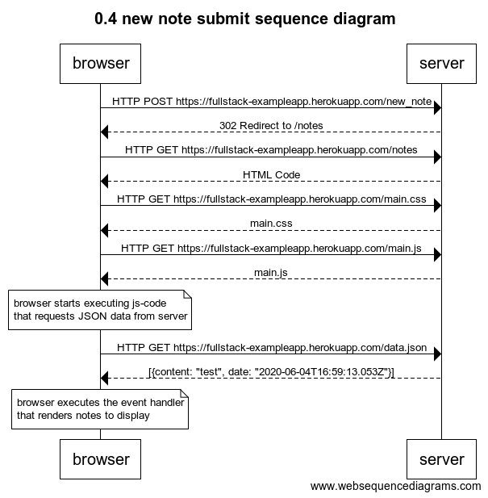
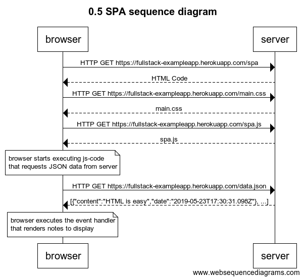

# Exercise 0.4

~~~
title 0.4 new note submit sequence diagram

browser->server: HTTP POST https://fullstack-exampleapp.herokuapp.com/new_note
server-->browser: 302 Redirect to /notes
browser->server: HTTP GET https://fullstack-exampleapp.herokuapp.com/notes
server-->browser: HTML Code
browser->server: HTTP GET https://fullstack-exampleapp.herokuapp.com/main.css
server-->browser: main.css
browser->server: HTTP GET https://fullstack-exampleapp.herokuapp.com/main.js
server-->browser: main.js

note over browser:
browser starts executing js-code
that requests JSON data from server 
end note

browser->server: HTTP GET https://fullstack-exampleapp.herokuapp.com/data.json
server-->browser: [{content: "test", date: "2020-06-04T16:59:13.053Z"}]

note over browser:
browser executes the event handler
that renders notes to display
end note
~~~

# Exercise 0.5

~~~
title 0.5 SPA sequence diagram

browser->server: HTTP GET https://fullstack-exampleapp.herokuapp.com/spa
server-->browser: HTML Code
browser->server: HTTP GET https://fullstack-exampleapp.herokuapp.com/main.css
server-->browser: main.css
browser->server: HTTP GET https://fullstack-exampleapp.herokuapp.com/spa.js
server-->browser: spa.js

note over browser:
browser starts executing js-code
that requests JSON data from server 
end note

browser->server: HTTP GET https://fullstack-exampleapp.herokuapp.com/data.json
server-->browser: [{"content":"HTML is easy","date":"2019-05-23T17:30:31.098Z"}, ...]

note over browser:
browser executes the event handler
that renders notes to display
end note
~~~
